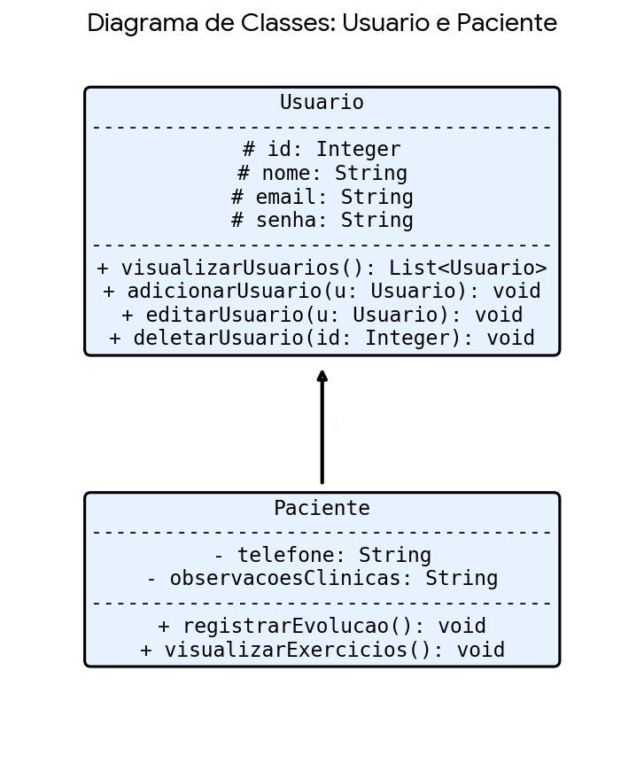

# 📑 Entrega 1: Estrutura de Programação Orientada a Objetos
---

### 🧬 Hierarquia de Classes e Atributos

A estrutura utiliza a relação onde um **Paciente** herda as propriedades de um **Usuário**.

#### 1. Classe: Usuario (Superclasse)
Responsável pelas informações básicas de identificação e autenticação.
* **`id` (`Int`)**: Identificador único do registro.
* **`nome` (`String`)**: Nome completo do usuário.
* **`email` (`String`)**: Endereço para login e contato.
* **`senha` (`String`)**: Credencial de acesso com proteção por hash.

#### 2. Classe: Paciente (Subclasse)
Especialização que contém os dados específicos para o tratamento de RPG.
* **Atributos Herdados**: (id: Int, nome: String, email: String e senha: String).
* **`telefone` (`String`)**: Para envio de lembretes e notificações via push ou WhatsApp.
* **`observacoesClinicas` (`String`)**: Campo para o prontuário e histórico de evolução do paciente.

---

### 🖼️ Diagrama de Classes
O diagrama abaixo representa a estrutura da função principal exigida nesta etapa, contemplando as entidades e seus respectivos tipos de dados.

---

### 🧬 Explicação da Arquitetura (Herança e Conexões)

#### 1. O Conceito de Herança ("É UM")
No diagrama, a classe **Paciente** estende(Herda) a classe **Usuario**. Isso estabelece uma relação de herança onde:
*  O Paciente herda automaticamente os atributos id, nome, email e senha da superclasse Usuario, evitando a repetição de código.
* A subclasse Paciente foca exclusivamente em atributos clínicos, como telefone (para notificações) e observacoesClinicas (para o prontuário de RPG).

#### 2. Conexões e Fluxo de Dados (CRUD)
As conexões entre as entidades permitem que a função principal do sistema opere de forma integrada:
* **Identificação por ID**: O atributo id (Integer) funciona como a chave de conexão. Ele permite que o sistema localize um Usuario específico para realizar edições ou a exclusão do registro conforme solicitado.
* **Integridade dos Dados**: Como o Paciente é um Usuario, qualquer alteração no e-mail de login reflete instantaneamente no perfil clínico, mantendo os dados sincronizados.
---

### 🔄 Regras de Conexão (CRUD)
A modelagem permite as operações fundamentais para a gestão da clínica:
* **Visualizar**: Listagem de pacientes ativos no sistema.
* **Adicionar**: Cadastro de novos usuários e pacientes.
* **Editar**: Atualização de informações de contato ou prontuário.
* **Deletar**: Remoção ou inativação de registros.

---
