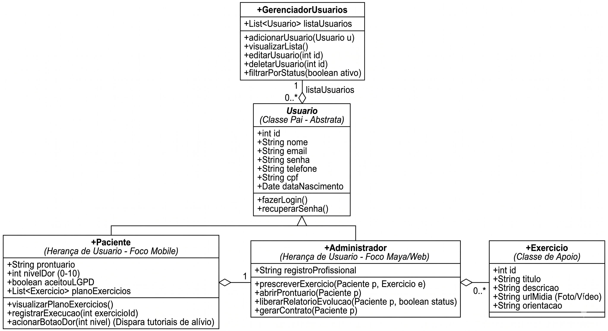

# 📋 Sistema Maya - Entrega (POO 2)

Este repositório contém a modelagem e a estrutura de classes do **Sistema Maya**, desenvolvido para automatizar os processos de atendimento, controle de prontuários e prescrição de exercícios em uma clínica de fisioterapia (substituindo o antigo fluxo manual e repetitivo).

O projeto aplica conceitos fundamentais de **Programação Orientada a Objetos avançada (POO 2)**, como Herança, Polimorfismo, Encapsulamento e Classes Abstratas, separando claramente as responsabilidades entre a gestão da clínica (Web) e o acesso dos pacientes (Mobile).

---

## 🏗️ Arquitetura e Princípios de POO Aplicados

* **Encapsulamento:** Todos os atributos do sistema são privados/protegidos, garantindo a integridade dos dados clínicos e o acesso seguro exclusivamente via métodos *Getters e Setters*.
* **Classe Abstrata:** A classe `Usuario` centraliza os dados comuns de cadastro, mas não pode ser instanciada diretamente, garantindo que todo usuário no sistema tenha um papel bem definido (`Paciente` ou `Administrador`).
* **Herança:** `Paciente` e `Administrador` herdam de `Usuario`, reaproveitando código de autenticação e identificação, mas implementando comportamentos e focos distintos.
* **Agregação e Composição:** Relações semânticas claras onde o plano de exercícios pertence ao paciente, e a gestão de usuários fica isolada em um controlador específico.

---

## 📦 Estrutura das Classes

### 1. `GerenciadorUsuarios` (Controlador)
Responsável pela lógica de controle e centralização do CRUD de usuários.
* **Atributo Principal:** Mantém uma lista polimórfica (`List<Usuario>`) que é capaz de armazenar tanto Pacientes quanto Administradores.
* **Responsabilidade:** Adicionar, visualizar, editar, deletar e filtrar cadastros com base no status de atividade.

### 2. `Usuario` (Classe Pai - Abstrata)
Define a estrutura base para qualquer pessoa com acesso ao sistema.
* **Atributos:** `id`, `nome`, `email`, `senha`, `telefone`, `cpf` e `dataNascimento`.
* **Métodos:** `fazerLogin()` e `recuperarSenha()`. 

### 3. `Paciente` (Subclasse de Usuario - Foco Mobile)
Representa o cliente da clínica que acessa o sistema para acompanhar seu tratamento.
* **Atributos Específicos:** `prontuario`, `nivelDor` (escala de 0 a 10), `aceitouLGPD` (garantindo conformidade legal) e a lista do seu `planoExercicios`.
* **Métodos Específicos:** * `visualizarPlanoExercicios()`: Exibe a rotina prescrita.
  * `registrarExecucao(int exercicioId)`: Confirma a realização de uma atividade.
  * `acionarBotaoDor(int nivel)`: Dispara tutoriais de alívio imediato caso o paciente relate dor aguda.

### 4. `Administrador` (Subclasse de Usuario - Foco Web / Maya)
Representa a profissional de saúde (Maya) gerenciando a clínica.
* **Atributos Específicos:** `registroProfissional` (ex: CREFITO).
* **Métodos Específicos (Ações de Negócio):**
  * `prescreverExercicio(Paciente p, Exercicio e)`: Adiciona um exercício específico ao plano do paciente.
  * `abrirProntuario(Paciente p)`: Acessa os dados clínicos e histórico.
  * `liberarRelatorioEvolucao(Paciente p, boolean status)`: Controla a visibilidade da evolução do tratamento.
  * `gerarContrato(Paciente p)`: Automatiza a criação do documento de prestação de serviços.

### 5. `Exercicio` (Classe de Domínio / Apoio)
Estrutura os dados das atividades que compõem o tratamento.
* **Atributos:** `id`, `titulo`, `descricao`, `urlMidia` (link para fotos ou vídeos demonstrativos) e `orientacao` (instruções textuais da fisioterapeuta).

---

## 🔗 Relacionamentos do Sistema

1. **`GerenciadorUsuarios` ➔ `Usuario`**: Composição. O gerenciador controla o ciclo de vida e a lista total dos usuários cadastrados.
2. **`Paciente` e `Administrador` ➔ `Usuario`**: Herança. Ambos são tipos específicos de usuário.
3. **`Administrador` ➔ `Paciente`**: Relação de Associação/Gerenciamento. O administrador atende, abre prontuários e manipula os dados dos pacientes.
4. **`Paciente` ➔ `Exercicio`**: Agregação. Um paciente possui uma lista de exercícios (`planoExercicios`) prescrita especificamente para sua recuperação.

### 🖼️ Diagrama de Classes
O diagrama abaixo representa a estrutura da função principal exigida nesta etapa, contemplando as entidades e seus respectivos tipos de dados.

